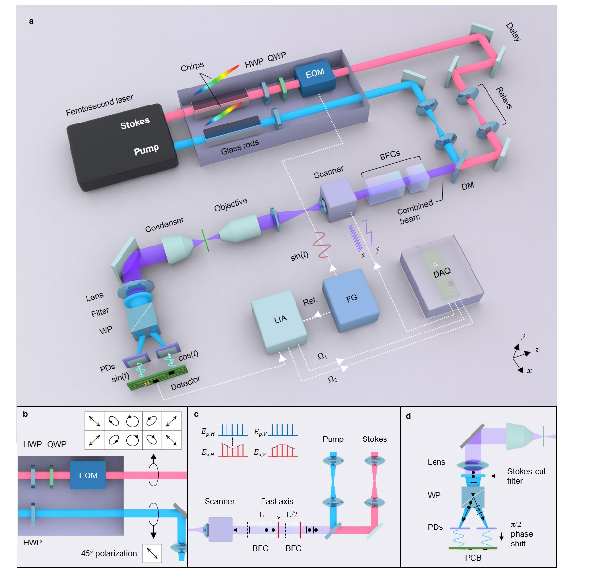
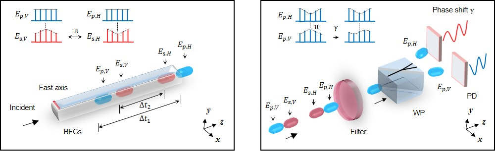
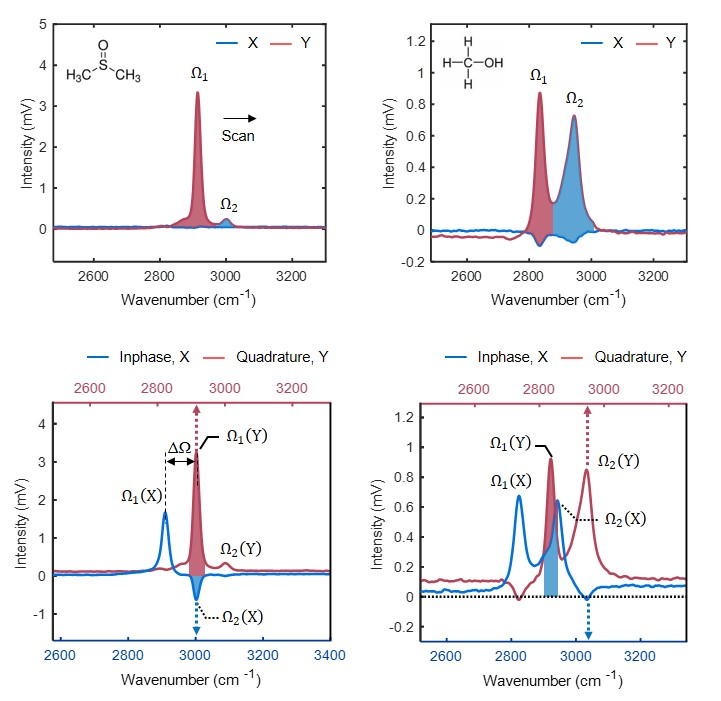

# 🔬 SDRSRS Code & Software Package

**Simultaneous Dual-Raman-Shift Scanning-Free Stimulated Raman Scattering Microscopy**

---

## 📌 Overview

This repository contains the **custom analysis and visualization code** used in the manuscript:

> *Simultaneous Dual-Raman-Shift Scanning-Free Stimulated Raman Scattering Microscopy for Label-Free Biomolecular Imaging*

### 🔧 System concept at a glance



The software supports the complete SDRSRS workflow:

```
┌──────────────────────────────────────────┐
│  Birefringent-crystal Raman-shift model │
│        (Sellmeier-based)                │
├──────────────────────────────────────────┤
│  Dual-channel SDRSRS spectral analysis  │
│   (X / Y orthogonal demodulation)       │
├──────────────────────────────────────────┤
│  PCA / UMAP statistical classification │
│   (paired CH₃–CH₂ biochemical data)    │
└──────────────────────────────────────────┘
```

All scripts are provided for **reviewer assessment, transparency, and reproducibility**.

---

## 🧠 Dual-Raman-shift principle



Simultaneous acquisition of two Raman shifts (Ω₁, Ω₂) is enabled by a **birefringent-crystal–induced optical path difference (OPD)** combined with orthogonal polarization modulation and phase-sensitive detection.
This allows **strictly synchronous CH₃–CH₂ measurements without spectral scanning**.


## 💻 1. System Requirements

### 🖥 Operating Systems

* Windows 10 / 11 (tested)
* macOS 12+ (Intel / Apple Silicon)
* Linux (Ubuntu 20.04+)

### 🧮 MATLAB

* MATLAB **R2021a or newer** (tested up to R2023b)
* Toolboxes:

  * Signal Processing Toolbox
  * Statistics and Machine Learning Toolbox

### 🐍 Python

* Python ≥ 3.8 (tested: 3.9–3.10)

```bash
pip install numpy scipy pandas matplotlib scikit-learn umap-learn jupyter
```

### 🧰 Hardware

* Standard desktop/laptop
* ❌ No SRS microscope hardware required to run the code

---

## ▶️ 2. Demo & Expected Output

### 🧪 Demo A — Raman-shift separation vs crystal length

**Script:** `Sellmeier_birefringence.m`

Reproduces Raman-shift separation ΔΩ as a function of birefringent-crystal length.

```matlab
Sellmeier_birefringence
```

⏱ Runtime: < 2 s

---

### 🧪 Demo B — SDRSRS dual-channel spectra

**Script:** `SDRSRS_Spectra_public.m`



Reproduces simultaneous X/Y demodulated Raman spectra.

```matlab
SDRSRS_Spectra_public
```

⏱ Runtime: < 5 s

---

### 🧪 Demo C — PCA / UMAP statistical analysis

**Notebook:** `PCA_UMAP_analysis_mouse_model.ipynb`

Performs PCA and UMAP on **biological replicates** of paired CH₃–CH₂ data.

```bash
jupyter notebook PCA_UMAP_analysis_mouse_model.ipynb
```

⏱ Runtime: < 1 min


## Software and algorithms (pseudocode description)

The custom software package contains three functional modules that correspond to the quantitative analyses in this manuscript: (i) Sellmeier-based birefringent-crystal modeling for Raman-shift separation prediction, (ii) dual-channel SDRSRS spectral reconstruction and visualization from X/Y orthogonal demodulation, and (iii) multivariate statistical analysis (PCA/UMAP) for tissue-state discrimination using paired CH₃–CH₂ measurements. All computations are deterministic given the same inputs and software versions.

### Module 1: Sellmeier-based birefringent-crystal Raman-shift separation model (MATLAB)

This module predicts the Raman-shift separation ΔΩ induced by a birefringent crystal (e.g., YVO₄) as a function of crystal length. The model first computes ordinary and extraordinary refractive indices at the pump and Stokes wavelengths using the Sellmeier equations, then converts birefringence into optical path differences, and finally maps the differential optical path between pump and Stokes polarization components to ΔΩ via a calibrated proportionality.

**Pseudocode**

```
INPUT: wavelength_pump, wavelength_stokes, crystal_material_constants
INPUT: crystal_length_list (e.g., 0.5–4.5 cm)
INPUT: mapping_coefficient_k (OPD → ΔΩ), optional modified mapping factor

FOR each crystal_length L in crystal_length_list:
    compute n_o_pump(L) and n_e_pump(L) from Sellmeier(wavelength_pump)
    compute n_o_stokes(L) and n_e_stokes(L) from Sellmeier(wavelength_stokes)

    birefringence_pump  = n_e_pump  - n_o_pump
    birefringence_stokes = n_e_stokes - n_o_stokes

    OPD_pump  = birefringence_pump  × L
    OPD_stokes = birefringence_stokes × L

    differential_OPD = OPD_pump - OPD_stokes

    ΔΩ_standard = mapping_coefficient_k × differential_OPD
    ΔΩ_modified = ΔΩ_standard × (optional scale factor)

STORE ΔΩ as function of L
PLOT ΔΩ(L) with measurement points overlaid (if provided)
OUTPUT: ΔΩ–length curve used to choose crystal length for target vibrational pairs
```

This pseudocode corresponds to `Sellmeier_birefringence.m` and reproduces the ΔΩ versus BFC length relationship used to select the 1–4 cm plug-and-play crystal configurations.

---

### Module 2: Dual-channel SDRSRS spectral reconstruction and visualization (MATLAB)

This module takes lock-in demodulated signals from orthogonal channels (X and Y) and reconstructs simultaneous SDRSRS spectra. The code converts discrete scan indices into Raman wavenumbers using a calibration offset and step size, applies baseline correction, scales units, and generates plots that visualize channel separation and the apparent Raman-shift offset ΔΩ between X and Y demodulation.

**Pseudocode**

```
INPUT: raw demodulated arrays for each measurement file:
       X_signal(t), Y_signal(t), optional_reference(t)
INPUT: selected index window t_range for each dataset
INPUT: wavenumber_step ds, calibration_offset calib
INPUT: known channel separation shift x_shift (for dual-axis overlay plots)

FOR each dataset (e.g., DMSO single-channel, MeOH single-channel, DMSO dual-channel, MeOH dual-channel):
    read raw data matrix from file
    select rows by t_range
    X ← X_signal(t_range)
    Y ← Y_signal(t_range)
    R ← optional_reference(t_range)

    baseline-correct (e.g., subtract min or DC offset if needed)
    scale intensity to display units (e.g., mV)

    wavenumber_axis = [1..N] × ds + calib

    IF dataset is “single-channel spectral display”:
        plot X(wavenumber_axis) and Y(wavenumber_axis)
        highlight peak regions corresponding to Ω1 and Ω2
        annotate peak positions and overlap regions
    ELSE IF dataset is “dual-axis overlay display”:
        plot Y on top x-axis vs wavenumber_axis
        plot X on bottom x-axis vs (wavenumber_axis + x_shift)
        highlight Ω1/Ω2 regions and the measured apparent ΔΩ
        add reference baseline and axis separation marker

OUTPUT: publication-ready spectral plots for simultaneous X/Y demodulation
```

This pseudocode corresponds to `SDRSRS_Spectra_public.m` and reproduces the simultaneous spectral behavior shown in the manuscript figures (dual-channel X/Y demodulation).

---

### Module 3: Paired CH₃–CH₂ statistical analysis and visualization (Python/Jupyter)

This module performs sample-level statistical analysis using paired CH₃ and CH₂ measurements derived from SDRSRS imaging. The software computes features such as CH₃ intensity, CH₂ intensity, and CH₃/CH₂ ratio, then applies PCA for linear dimensionality reduction and UMAP for nonlinear embedding. Group separation is evaluated using clustering (k-means) and classification metrics when applicable. Importantly, the analysis is performed at the level of biological replicates (e.g., tissue regions or per-animal/per-patient aggregates) rather than pixel-level points.

**Pseudocode**

```
INPUT: table of biological replicates:
       each row = one replicate (e.g., region, per-animal aggregate, per-patient sample)
       columns include: CH3_intensity, CH2_intensity, ratio, label/group

LOAD replicate table
REMOVE missing or invalid entries (predefined exclusion criteria)
OPTIONALLY normalize intensities (e.g., z-score within dataset or global scaling)

FEATURE_MATRIX ← [CH3_intensity, CH2_intensity, ratio, ...] for each replicate
LABELS ← group identity (e.g., normal/cancer/CRT/PDT or cancer/paracancerous)

# PCA
PCA_MODEL ← fit PCA on FEATURE_MATRIX
PCA_EMBED ← transform FEATURE_MATRIX into first 2–3 components
REPORT explained variance of PCs
PLOT PCA_EMBED with points colored by LABELS

# UMAP
UMAP_MODEL ← fit UMAP on FEATURE_MATRIX with fixed random seed
UMAP_EMBED ← transform FEATURE_MATRIX into 2D
PLOT UMAP_EMBED with points colored by LABELS

# Clustering support (optional)
KMEANS_MODEL ← fit k-means with chosen k
CLUSTER_ASSIGN ← predict clusters for FEATURE_MATRIX
COMPARE cluster labels with known LABELS (purity / agreement)

# Group discrimination metrics (when binary or one-vs-rest)
IF classification is performed:
    train classifier on FEATURE_MATRIX (with cross-validation)
    compute ROC curve and AUC
    report confidence intervals via bootstrap or CV aggregation

OUTPUT: PCA plots, UMAP plots, clustering summaries, and optional ROC/AUC statistics
SAVE figures and summary tables
```

This pseudocode corresponds to the `PCA_UMAP_analysis.ipynb` notebooks and reproduces the multivariate analyses used for tissue discrimination in the manuscript.


> All statistical analyses operate on **biological replicates**, not pixel-level data, consistent with the manuscript’s *Statistics and reproducibility* section.

---

## 📬 Contact & Data Availability

All data and code supporting this study are available upon reasonable request.
📧 **Contact:** `It will be available after publication`
